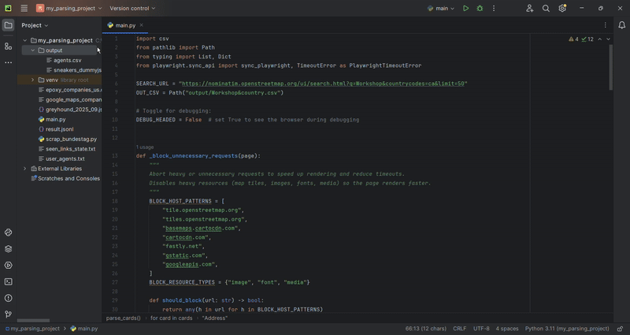

[README.md.txt](https://github.com/user-attachments/files/22476977/README.md.txt)
# Nominatim Workshop & Country Scraper

This project scrapes location data from the [Nominatim OpenStreetMap UI](https://nominatim.openstreetmap.org/)  
for entries matching the query **"Workshop"** in a specific country (Canada in this example).  
The results are saved to a CSV file.

## Features
- Uses **Playwright** for reliable browser automation
- Blocks heavy resources (map tiles, images, fonts) for faster loading
- Retries on failure with configurable timeouts
- Saves results in CSV format

## Project Structure
```
Nominatim-Workshop-Country-Scraper/ 
├── src/main.py # main scraper script 
├── output/
│   └── Workshop&country.csv # output CSV and optional screenshots
├── docs/
│   └── demo.gif
├── .gitignore
├── requirements.txt # dependencies 
└── README.md # project description
```

## Installation
```bash
git clone https://github.com/Zhasulan-Agybay/Nominatim-Workshop-Country-Scraper.git
cd nominatim_Workshop-country
pip install -r requirements.txt
playwright install
python src/main.py
```

## Demo.gif


#### 👨💻 About This Project

Hi, my name is Zhasulan Agybay and this is my web scraping project.  
It demonstrates how to extract structured location data from the Nominatim OpenStreetMap UI using Playwright.  
You can check out my other projects on [GitHub](https://github.com/Zhasulan-Agybay).


## ⚖️ License
This project is licensed under the MIT License. See the [LICENSE](./LICENSE) file for details.
